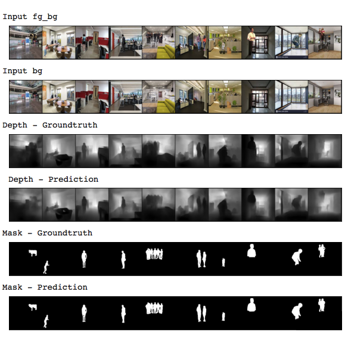
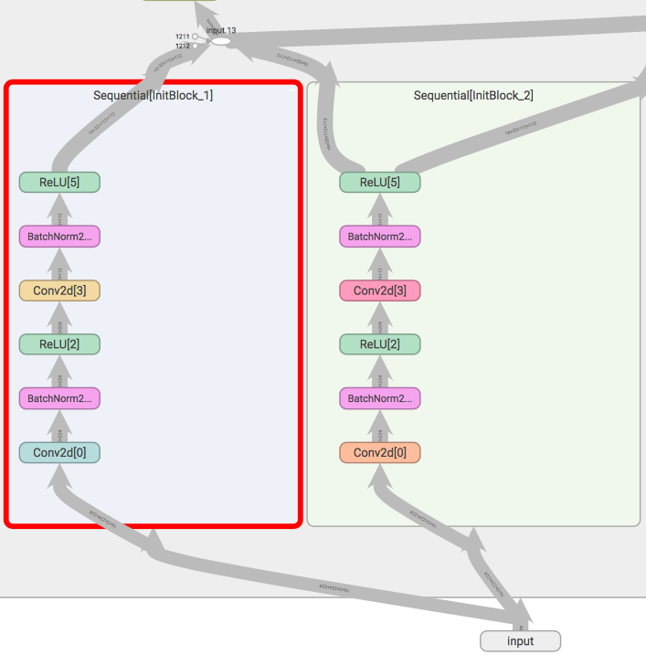
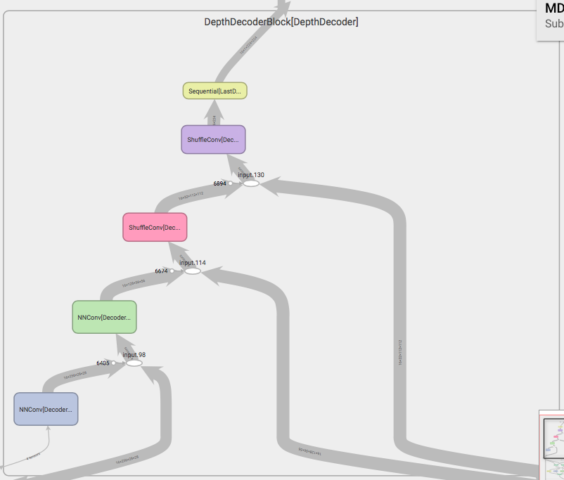
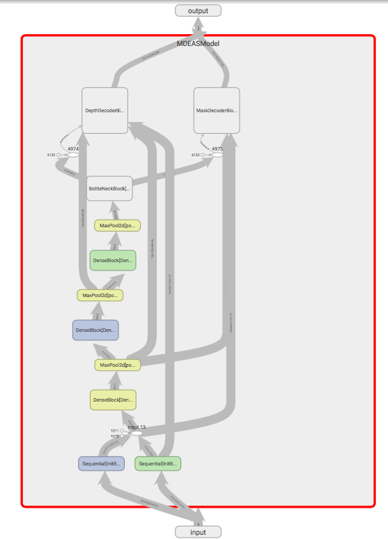

# # Monocular Depth Estimation And Segmentation [MDEAS]

## Project Description

In this image estimation project we are creating a CNN-Network that can do monocular depth estimation and foreground-background seperation simulataneously.

The MDEAS network should take two images as input.

1. Background image(bg).
2. Foreground overlayed background image(fg_bg).

And it should give two images as output.

* Depth estimation image.
* Mask for the foreground in background overlayed image.

For depth estimation task, the *input to the model is the fg-bg overlayed image. And that is in RGB format* and the *output depth image which is a grey-scale* image and should be in same dimension as the input image( Ground truth are also in same size of input).

For foregtound-background seperation(mask generation), the input to the model is, both fg-bg and background image. And both are in RGB format.

***All information related the custom dataset preperation strategy is well described [here!](https://github.com/rohitrnath/Monocular-Depth-Estimation-and-Segmentation/blob/master/Dataset_Preparation/README.md)***


## Summary

### Input Image

Both background and foreground-background image is of size 224\*224\*3, its RGB images.


----------------------------------------------------------------

### Model

**Total params: 1,521,026  (1.5M)**

* Used an Encoder-(Bottleneck)-Decoder network
* MDEAS model having custom dense-net blocks.
* Bottleneck block consist of dilation kernels.
* Decoder network with two branches( for depth and mask separately)
* NN Conv, Pixel shuffling and Transpose convolution are used for upsample.
* Used *sigmoid* at the end of *Mask decoder block*

----------------------------------------------------------------

### Output

***Mask  Accuracy : 96.70%***

***Depth Accuracy : 92.26%***

* Both mask and depth estimations are of size 224\*224\*1, grey-scale images
* Used SSIM and MSE criterion combinations to find the loss (Most time taken part)
* Accuracy is calculated using SSIM and mean-IoU
* Tensorboard used for logging




----------------------------------------------------------------

## Preparations (Design Strategies)


## Model Overview

Here I'm describing how I architect the MDEAS model. What are the thought process went through my mind while design each blocks.

At last we will discuss the complete model architecture and designs.

### MDEAS Model should be *Encoder-Decoder network*

At the initial stage many modeling plans came through my mind. I thought of using Unet, because its a state-of-art model to handle dense outputs. But its very heavy model for this purpose. So end-up with a decision to create my own ***encoder-decoder*** model.


### Concatenate two input images at Initial Block of Encoder

At the input of the network, we have to handle two input images. So the initial idea was, to concatenate the two images of size [224\*224\*3] to a single block of size [224\*224\*6]. But  if we do concatenation at before any convolutions, then only 3 layers will occupy with foreground, so the background information will dominate in the feed forward.

So I decided to pass the input images through separate convolution blocks and then concatenate the convolution output. We can call the speacial *block that perform this initial convolution and concatenation* as ***Initial block***.

I thought of to use separate  2\* ***normal convolutions at initial block***, while other blocks uses depthwise convolution. By using normal convolution, this layer can able to fetch more features from the input image and aggragating both convolution output at the concatenation layer will help to provide fine tune data for other layers.

#### Initial Block implementation in pytorch

```python
# Initial convolution implmentation in pytorch
InitConv =nn.Sequential(
            nn.Conv2d(inp, oup, 3, 1, 1, bias=False),
            nn.BatchNorm2d(oup),
            nn.ReLU(),
            nn.Conv2d(oup, oup, 3, 2, 1, bias=False), #stride=2, padding=1, divide the size by 2x2
            nn.BatchNorm2d(oup),
            nn.ReLU(),
          )

#Initial Block
class InitBlock(nn.Module):
    def __init__(self):
        super(InitBlock, self).__init__()
        self.InitBlock_1  = InitConv( 3, 32)		
        self.InitBlock_2  = InitConv( 3, 32)
 
    def forward(self,  bg, fg_bg):											#bg= 224*224*3//1, #fg= 224*224*3//1

        InitOut_1 = self.InitBlock_1(bg)								#112*112*32				
        InitOut_2 = self.InitBlock_2(fg_bg)
        
        InitOut   = torch.cat([InitOut_1, InitOut_2], 1)

        return InitOut, InitOut_1, InitOut_2
```

While implementiong Init block, I choose to pass the input bg and fg_bg to 2 convolution layers that convert the 3 channel input to 32 channels. After concatenation the output from initblock become a single block with 64 channels(32+32).

The second ***Convolution layer with strid=2 act like maxpool(2)***, means it reduce the channel size by 2x2.


#### Initial Block image from Tensorboard graph




### Use *Depthwise Convolution* for a light-weight model

​								As because I'm from embedded systems domain, I'm always conscious about memory and cpu optimisation. So I was thinking of designing a model with less params also it should be efficient to do the job. In the world of CNN, while thinking of light-weight model, the first option comes to our mind will be MobileNet. In mobilenet use of depthwise convolution  blocks makes it lighter. So I decided to use ***depthwise convolutions in my architecture.***

```python
#Depthwise convolution in pytorch
DepthwiseConv = nn.Sequential(
  nn.Conv2d( in_panels, in_panels, kernel_size=(3,3), padding=1, groups=in_panels),
  nn.Conv2d( in_panels, out_panels, kernel_size=(1,1))
	)
```


In case of depthwise convolution with 3x3 kernel, takes only 9 times less parameters as compared to 3x3 normal convolution.


### *Dense-Block* as basic building block

In this project, depth estimation seems to be highly complex than the mask generation. But both are ***dense outputs***. For generating *dense out*, the ***global receptive field of the network should be high***, and the encoder output or the input to decoder should contain *multiple receptive fieds*.After going through [Dense Depth](https://arxiv.org/abs/1812.11941) paper, I understood dense blocks are very-good to carry multiple receptive fields in forward. Reidual blocks in resnet also carrying multipl receptive fields. But as the name suggest, dense-net blocks gives dense receptive fields. So I decided to use ***custom dense-blocks with depthwise convolution***(something similar we made in Quiz-9) as the basic building block of my network.

#### My Custom Dense Block

Dense block consist of 3 densely connected depthwise convolution layers

```python
#Pseudo Code	[dwConv = depthwise convolution]
x	 = input
x1 = dwConv(x)
x2 = dwConv(x + x1)
x3 = dwConv(x + x1 + x2)
out= x + x1 + x2 + x3
```

This same dense block is used in encoder and decoder as basic building block

For *Encoder*, ***maxpool*** got added at the end of Dense Block.

For *Decoder*, any of ***upsampling techique*** such as NNConv, Transpose Conv or Pixel shuffle got added at the end of Dense block.

#### Image from Tensorboard graph


### Encoder Design with Dense blocks

The encoder of the network consist of the initial block and 3* Encoder Blocks. Each encoder blocks consist of one Dense block followed by a maxpool(2) layer.


#### Complete Encoder Block


### Bottle-Neck Design With *Dilated Kernels*

As we discussed in session-6, ***dilated convolution*** can allows flexible aggregation of the multi-scale contextual information while keeping the same resolution. So by using multiple dilated convolutions in parallel on our network  can able to see image in multi-scale ranges and aggragation of these information is very useful for dense output. 

So I decided to add a ***block with dilated kernels of different dilations( 1, 3, 6, 9) as a bottle-neck*** in my network.


This paper describes how well dilated kernel understands congested scenes and helping in dense output [CSRNet: Dilated Convolutional Neural Networks for Understanding the Highly Congested Scenes](https://www.researchgate.net/publication/323444534_CSRNet_Dilated_Convolutional_Neural_Networks_for_Understanding_the_Highly_Congested_Scenes#pf4)


### Decoder

#### Mask Decoder


#### Depth Decoder




### MDEAS Model Structure



#### Model Parameters

```bash
----------------------------------------------------------------
        Layer (type)               Output Shape         Param #
================================================================
            Conv2d-1         [-1, 32, 224, 224]             864
       BatchNorm2d-2         [-1, 32, 224, 224]              64
              ReLU-3         [-1, 32, 224, 224]               0
            Conv2d-4         [-1, 32, 112, 112]           9,216
       BatchNorm2d-5         [-1, 32, 112, 112]              64
              ReLU-6         [-1, 32, 112, 112]               0
            Conv2d-7         [-1, 32, 224, 224]             864
       BatchNorm2d-8         [-1, 32, 224, 224]              64
              ReLU-9         [-1, 32, 224, 224]               0
           Conv2d-10         [-1, 32, 112, 112]           9,216
      BatchNorm2d-11         [-1, 32, 112, 112]              64
             ReLU-12         [-1, 32, 112, 112]               0
           Conv2d-13         [-1, 64, 112, 112]             640
           Conv2d-14         [-1, 64, 112, 112]           4,160
             ReLU-15         [-1, 64, 112, 112]               0
      BatchNorm2d-16         [-1, 64, 112, 112]             128
           Conv2d-17         [-1, 64, 112, 112]             640
           Conv2d-18         [-1, 64, 112, 112]           4,160
             ReLU-19         [-1, 64, 112, 112]               0
      BatchNorm2d-20         [-1, 64, 112, 112]             128
           Conv2d-21         [-1, 64, 112, 112]             640
           Conv2d-22         [-1, 64, 112, 112]           4,160
             ReLU-23         [-1, 64, 112, 112]               0
      BatchNorm2d-24         [-1, 64, 112, 112]             128
           Conv2d-25        [-1, 128, 112, 112]           8,320
             ReLU-26        [-1, 128, 112, 112]               0
      BatchNorm2d-27        [-1, 128, 112, 112]             256
       DenseBlock-28        [-1, 128, 112, 112]               0
        MaxPool2d-29          [-1, 128, 56, 56]               0
           Conv2d-30          [-1, 128, 56, 56]           1,280
           Conv2d-31          [-1, 128, 56, 56]          16,512
             ReLU-32          [-1, 128, 56, 56]               0
      BatchNorm2d-33          [-1, 128, 56, 56]             256
           Conv2d-34          [-1, 128, 56, 56]           1,280
           Conv2d-35          [-1, 128, 56, 56]          16,512
             ReLU-36          [-1, 128, 56, 56]               0
      BatchNorm2d-37          [-1, 128, 56, 56]             256
           Conv2d-38          [-1, 128, 56, 56]           1,280
           Conv2d-39          [-1, 128, 56, 56]          16,512
             ReLU-40          [-1, 128, 56, 56]               0
      BatchNorm2d-41          [-1, 128, 56, 56]             256
           Conv2d-42          [-1, 256, 56, 56]          33,024
             ReLU-43          [-1, 256, 56, 56]               0
      BatchNorm2d-44          [-1, 256, 56, 56]             512
       DenseBlock-45          [-1, 256, 56, 56]               0
        MaxPool2d-46          [-1, 256, 28, 28]               0
           Conv2d-47          [-1, 256, 28, 28]           2,560
           Conv2d-48          [-1, 256, 28, 28]          65,792
             ReLU-49          [-1, 256, 28, 28]               0
      BatchNorm2d-50          [-1, 256, 28, 28]             512
           Conv2d-51          [-1, 256, 28, 28]           2,560
           Conv2d-52          [-1, 256, 28, 28]          65,792
             ReLU-53          [-1, 256, 28, 28]               0
      BatchNorm2d-54          [-1, 256, 28, 28]             512
           Conv2d-55          [-1, 256, 28, 28]           2,560
           Conv2d-56          [-1, 256, 28, 28]          65,792
             ReLU-57          [-1, 256, 28, 28]               0
      BatchNorm2d-58          [-1, 256, 28, 28]             512
           Conv2d-59          [-1, 256, 28, 28]          65,792
             ReLU-60          [-1, 256, 28, 28]               0
      BatchNorm2d-61          [-1, 256, 28, 28]             512
       DenseBlock-62          [-1, 256, 28, 28]               0
        MaxPool2d-63          [-1, 256, 14, 14]               0
           Conv2d-64          [-1, 128, 14, 14]          32,896
             ReLU-65          [-1, 128, 14, 14]               0
      BatchNorm2d-66          [-1, 128, 14, 14]             256
           Conv2d-67          [-1, 128, 14, 14]           1,280
           Conv2d-68          [-1, 128, 14, 14]          16,512
             ReLU-69          [-1, 128, 14, 14]               0
      BatchNorm2d-70          [-1, 128, 14, 14]             256
           Conv2d-71          [-1, 128, 14, 14]           1,280
           Conv2d-72          [-1, 128, 14, 14]          16,512
             ReLU-73          [-1, 128, 14, 14]               0
      BatchNorm2d-74          [-1, 128, 14, 14]             256
           Conv2d-75          [-1, 128, 14, 14]           1,280
           Conv2d-76          [-1, 128, 14, 14]          16,512
             ReLU-77          [-1, 128, 14, 14]               0
      BatchNorm2d-78          [-1, 128, 14, 14]             256
           Conv2d-79          [-1, 128, 14, 14]           1,280
           Conv2d-80          [-1, 128, 14, 14]          16,512
             ReLU-81          [-1, 128, 14, 14]               0
      BatchNorm2d-82          [-1, 128, 14, 14]             256
           Conv2d-83          [-1, 128, 14, 14]          65,664
             ReLU-84          [-1, 128, 14, 14]               0
      BatchNorm2d-85          [-1, 128, 14, 14]             256
           Conv2d-86          [-1, 256, 14, 14]         131,328
             ReLU-87          [-1, 256, 14, 14]               0
      BatchNorm2d-88          [-1, 256, 14, 14]             512
  BottleNeckBlock-89  [[-1, 128, 14, 14], [-1, 256, 14, 14]]               0
           Conv2d-90          [-1, 256, 14, 14]           2,560
           Conv2d-91          [-1, 256, 14, 14]          65,792
             ReLU-92          [-1, 256, 14, 14]               0
      BatchNorm2d-93          [-1, 256, 14, 14]             512
           Conv2d-94          [-1, 256, 14, 14]           2,560
           Conv2d-95          [-1, 256, 14, 14]          65,792
             ReLU-96          [-1, 256, 14, 14]               0
      BatchNorm2d-97          [-1, 256, 14, 14]             512
           Conv2d-98          [-1, 256, 14, 14]           2,560
           Conv2d-99          [-1, 256, 14, 14]          65,792
            ReLU-100          [-1, 256, 14, 14]               0
     BatchNorm2d-101          [-1, 256, 14, 14]             512
          Conv2d-102          [-1, 256, 14, 14]          65,792
            ReLU-103          [-1, 256, 14, 14]               0
     BatchNorm2d-104          [-1, 256, 14, 14]             512
      DenseBlock-105          [-1, 256, 14, 14]               0
          NNConv-106          [-1, 256, 28, 28]               0
          Conv2d-107          [-1, 256, 28, 28]           2,560
          Conv2d-108          [-1, 256, 28, 28]          65,792
            ReLU-109          [-1, 256, 28, 28]               0
     BatchNorm2d-110          [-1, 256, 28, 28]             512
          Conv2d-111          [-1, 256, 28, 28]           2,560
          Conv2d-112          [-1, 256, 28, 28]          65,792
            ReLU-113          [-1, 256, 28, 28]               0
     BatchNorm2d-114          [-1, 256, 28, 28]             512
          Conv2d-115          [-1, 256, 28, 28]           2,560
          Conv2d-116          [-1, 256, 28, 28]          65,792
            ReLU-117          [-1, 256, 28, 28]               0
     BatchNorm2d-118          [-1, 256, 28, 28]             512
          Conv2d-119          [-1, 128, 28, 28]          32,896
            ReLU-120          [-1, 128, 28, 28]               0
     BatchNorm2d-121          [-1, 128, 28, 28]             256
      DenseBlock-122          [-1, 128, 28, 28]               0
          NNConv-123          [-1, 128, 56, 56]               0
          Conv2d-124          [-1, 128, 56, 56]           1,280
          Conv2d-125          [-1, 128, 56, 56]          16,512
            ReLU-126          [-1, 128, 56, 56]               0
     BatchNorm2d-127          [-1, 128, 56, 56]             256
          Conv2d-128          [-1, 128, 56, 56]           1,280
          Conv2d-129          [-1, 128, 56, 56]          16,512
            ReLU-130          [-1, 128, 56, 56]               0
     BatchNorm2d-131          [-1, 128, 56, 56]             256
          Conv2d-132          [-1, 128, 56, 56]           1,280
          Conv2d-133          [-1, 128, 56, 56]          16,512
            ReLU-134          [-1, 128, 56, 56]               0
     BatchNorm2d-135          [-1, 128, 56, 56]             256
          Conv2d-136          [-1, 128, 56, 56]          16,512
            ReLU-137          [-1, 128, 56, 56]               0
     BatchNorm2d-138          [-1, 128, 56, 56]             256
      DenseBlock-139          [-1, 128, 56, 56]               0
    PixelShuffle-140         [-1, 32, 112, 112]               0
     ShuffleConv-141         [-1, 32, 112, 112]               0
          Conv2d-142         [-1, 32, 112, 112]             320
          Conv2d-143         [-1, 32, 112, 112]           1,056
            ReLU-144         [-1, 32, 112, 112]               0
     BatchNorm2d-145         [-1, 32, 112, 112]              64
          Conv2d-146         [-1, 32, 112, 112]             320
          Conv2d-147         [-1, 32, 112, 112]           1,056
            ReLU-148         [-1, 32, 112, 112]               0
     BatchNorm2d-149         [-1, 32, 112, 112]              64
          Conv2d-150         [-1, 32, 112, 112]             320
          Conv2d-151         [-1, 32, 112, 112]           1,056
            ReLU-152         [-1, 32, 112, 112]               0
     BatchNorm2d-153         [-1, 32, 112, 112]              64
          Conv2d-154         [-1, 64, 112, 112]           2,112
            ReLU-155         [-1, 64, 112, 112]               0
     BatchNorm2d-156         [-1, 64, 112, 112]             128
      DenseBlock-157         [-1, 64, 112, 112]               0
    PixelShuffle-158         [-1, 16, 224, 224]               0
     ShuffleConv-159         [-1, 16, 224, 224]               0
          Conv2d-160          [-1, 1, 224, 224]              17
DepthDecoderBlock-161          [-1, 1, 224, 224]               0
          Conv2d-162          [-1, 128, 14, 14]           1,280
          Conv2d-163          [-1, 128, 14, 14]          16,512
            ReLU-164          [-1, 128, 14, 14]               0
     BatchNorm2d-165          [-1, 128, 14, 14]             256
          Conv2d-166          [-1, 128, 14, 14]           1,280
          Conv2d-167          [-1, 128, 14, 14]          16,512
            ReLU-168          [-1, 128, 14, 14]               0
     BatchNorm2d-169          [-1, 128, 14, 14]             256
          Conv2d-170          [-1, 128, 14, 14]           1,280
          Conv2d-171          [-1, 128, 14, 14]          16,512
            ReLU-172          [-1, 128, 14, 14]               0
     BatchNorm2d-173          [-1, 128, 14, 14]             256
          Conv2d-174          [-1, 128, 14, 14]          16,512
            ReLU-175          [-1, 128, 14, 14]               0
     BatchNorm2d-176          [-1, 128, 14, 14]             256
      DenseBlock-177          [-1, 128, 14, 14]               0
          NNConv-178          [-1, 128, 28, 28]               0
          Conv2d-179          [-1, 128, 28, 28]           1,280
          Conv2d-180          [-1, 128, 28, 28]          16,512
            ReLU-181          [-1, 128, 28, 28]               0
     BatchNorm2d-182          [-1, 128, 28, 28]             256
          Conv2d-183          [-1, 128, 28, 28]           1,280
          Conv2d-184          [-1, 128, 28, 28]          16,512
            ReLU-185          [-1, 128, 28, 28]               0
     BatchNorm2d-186          [-1, 128, 28, 28]             256
          Conv2d-187          [-1, 128, 28, 28]           1,280
          Conv2d-188          [-1, 128, 28, 28]          16,512
            ReLU-189          [-1, 128, 28, 28]               0
     BatchNorm2d-190          [-1, 128, 28, 28]             256
          Conv2d-191          [-1, 128, 28, 28]          16,512
            ReLU-192          [-1, 128, 28, 28]               0
     BatchNorm2d-193          [-1, 128, 28, 28]             256
      DenseBlock-194          [-1, 128, 28, 28]               0
          NNConv-195          [-1, 128, 56, 56]               0
          Conv2d-196          [-1, 128, 56, 56]           1,280
          Conv2d-197          [-1, 128, 56, 56]          16,512
            ReLU-198          [-1, 128, 56, 56]               0
     BatchNorm2d-199          [-1, 128, 56, 56]             256
          Conv2d-200          [-1, 128, 56, 56]           1,280
          Conv2d-201          [-1, 128, 56, 56]          16,512
            ReLU-202          [-1, 128, 56, 56]               0
     BatchNorm2d-203          [-1, 128, 56, 56]             256
          Conv2d-204          [-1, 128, 56, 56]           1,280
          Conv2d-205          [-1, 128, 56, 56]          16,512
            ReLU-206          [-1, 128, 56, 56]               0
     BatchNorm2d-207          [-1, 128, 56, 56]             256
          Conv2d-208           [-1, 64, 56, 56]           8,256
            ReLU-209           [-1, 64, 56, 56]               0
     BatchNorm2d-210           [-1, 64, 56, 56]             128
      DenseBlock-211           [-1, 64, 56, 56]               0
          NNConv-212         [-1, 64, 112, 112]               0
          Conv2d-213         [-1, 64, 112, 112]             640
          Conv2d-214         [-1, 64, 112, 112]           4,160
            ReLU-215         [-1, 64, 112, 112]               0
     BatchNorm2d-216         [-1, 64, 112, 112]             128
          Conv2d-217         [-1, 64, 112, 112]             640
          Conv2d-218         [-1, 64, 112, 112]           4,160
            ReLU-219         [-1, 64, 112, 112]               0
     BatchNorm2d-220         [-1, 64, 112, 112]             128
          Conv2d-221         [-1, 64, 112, 112]             640
          Conv2d-222         [-1, 64, 112, 112]           4,160
            ReLU-223         [-1, 64, 112, 112]               0
     BatchNorm2d-224         [-1, 64, 112, 112]             128
          Conv2d-225         [-1, 64, 112, 112]           4,160
            ReLU-226         [-1, 64, 112, 112]               0
     BatchNorm2d-227         [-1, 64, 112, 112]             128
      DenseBlock-228         [-1, 64, 112, 112]               0
    PixelShuffle-229         [-1, 16, 224, 224]               0
     ShuffleConv-230         [-1, 16, 224, 224]               0
          Conv2d-231          [-1, 1, 224, 224]              17
MaskDecoderBlock-232          [-1, 1, 224, 224]               0
================================================================
Total params: 1,521,026
Trainable params: 1,521,026
Non-trainable params: 0
----------------------------------------------------------------
Input size (MB): 86436.00
Forward/backward pass size (MB): 8952.84
Params size (MB): 5.80
Estimated Total Size (MB): 95394.64
----------------------------------------------------------------
```


## Training Strategy

[](https://github.com/rohitrnath/Monocular-Depth-Estimation-and-Segmentation/blob/master/Sample-Notebooks/TrainingWith10kImages(DebugMode).ipynb)


[](https://github.com/rohitrnath/Monocular-Depth-Estimation-and-Segmentation/blob/master/Sample-Notebooks/TransferLearningWith400kImages.ipynb)


