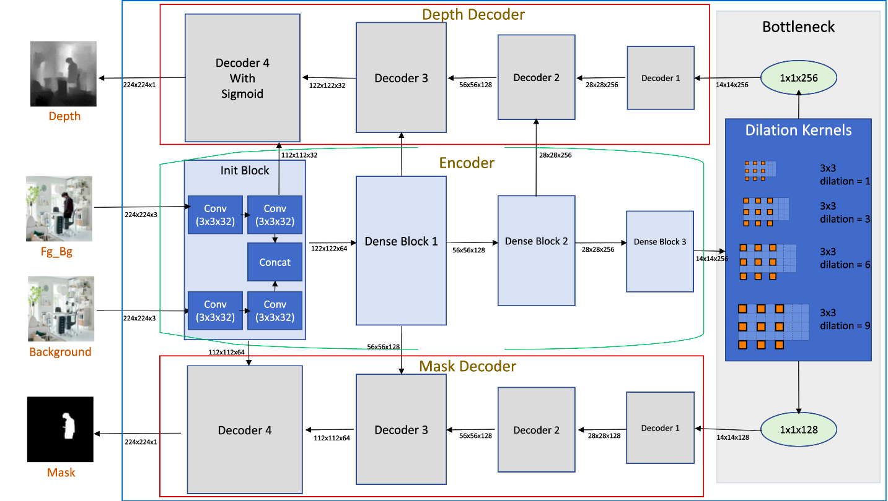
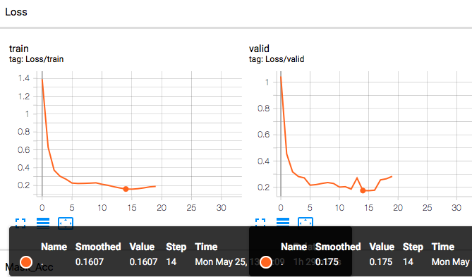
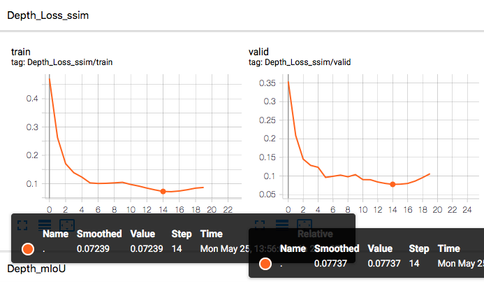
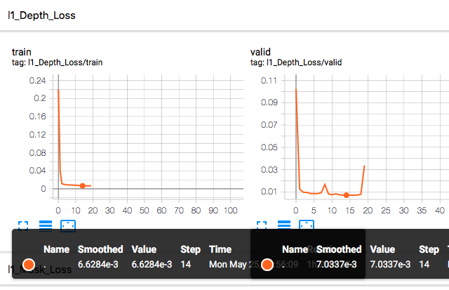
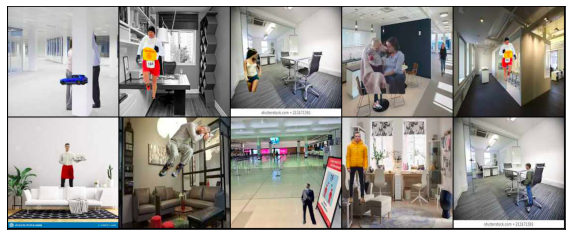
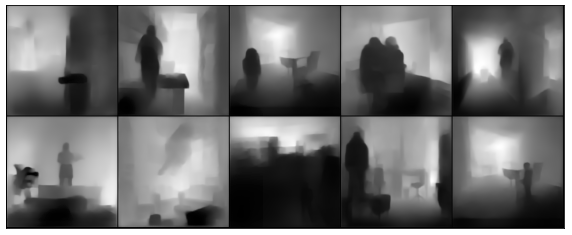
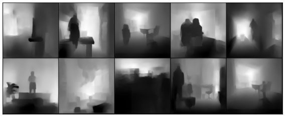
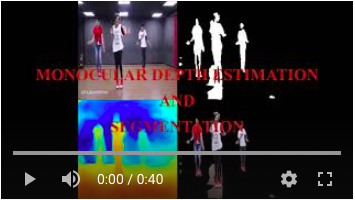

# Monocular Depth Estimation And Segmentation [MDEAS]

## Project Description

In this image estimation project we are creating a CNN-Network that can do monocular depth estimation and foreground-background separation simultaneously.

***Use Case : For autonomous bots like 'rumba' we can use this model for real-time tracking of changes in the environment by using foreground-background seperation, and could able to find the distance with depth estimation.***


The MDEAS network should take two images as input.

1. Background image(bg).
2. Foreground overlayed background image(fg_bg).

And it should give two images as output.

* Depth estimation image.
* Mask for the foreground in background overlayed image.

For depth estimation task, the *input to the model is the fg-bg overlayed image. And that is in RGB format* and the *output depth image which is a grey-scale* image and should be in same dimension as the input image( Ground truth are also in same size of input).

For foregtound-background seperation(mask generation), the input to the model is, both fg-bg and background image. And both are in RGB format.

***All information related the custom dataset preperation strategy is well described [here!](https://github.com/rohitrnath/Monocular-Depth-Estimation-and-Segmentation/blob/master/Dataset_Preparation/README.md)***


## Summary

### Personal Objective

As because I'm from embedded systems domain, I'm always conscious about memory and cpu optimisation. So I was thinking of designing a model with less params also it should be efficient to do the job with some decent accuracy.

### Input Image

Both background and foreground-background image is of size 224\*224\*3, its RGB images.


----------------------------------------------------------------

### [Model](#MDEAS-Model-Structure)

**Total params: 1,521,026  (1.5M)** 

* Used an Encoder-(Bottleneck)-Decoder network
* MDEAS model having custom ***dense-net blocks***.
* Bottleneck block consist of ***dilation kernels***.
* Decoder network with two branches( for depth and mask separately)
* ***Pixel shuffling, NN Conv and Transpose convolution*** are used for upsample.
* Used ***sigmoid at the end of Mask decoder block***

----------------------------------------------------------------

### Output

***Mask  Accuracy : 98.00%***

***Depth Accuracy : 93.27%***

* Both mask and depth estimations are of size 224\*224\*1, grey-scale images
* Used SSIM and MSE criterion combinations to find the loss (Most time taken part)
* Accuracy is calculated using SSIM and mean-IoU
* Tensorboard used for logging


***[Github link to Debug Training file](https://github.com/rohitrnath/Monocular-Depth-Estimation-and-Segmentation/blob/master/Sample-Notebooks/DebugTrainingWith10kImages.ipynb)***                                                                                                          

*Actual training is done by using the trained weights from Debug Training*

 ***[ Github link to Actual Training file](https://github.com/rohitrnath/Monocular-Depth-Estimation-and-Segmentation/blob/master/Sample-Notebooks/TransferLearnWith400kImages.ipynb)***  


## Contents

* [**Model Overview](#Model-Overview)
* [Modules and Hyper Params](#Modules-and-Hyper-Params)
* [Training Strategy](#Training-Strategy)
* [**Training with Transfer Learning ](#Training-with-Transfer-Learning )
* [Evaluation](#Evaluation)
* [Demo Video](#Demo-Video)

## Model Overview

Here I'm describing how I architect the MDEAS model. What are the thought process went through my mind while design each blocks.

### MDEAS Model Structure

Here is the MDEAS Model Architecture. 




[Python implementation of complete model with individual modules are available here](https://github.com/rohitrnath/Monocular-Depth-Estimation-and-Segmentation/blob/master/model/MDEASModel_backup.py)


Below I'm explaining about, how did I come up to this architectre designing.


### MDEAS Model should be *Encoder-Decoder network*

At the initial stage many modeling plans came through my mind. I thought of using Unet, because its a state-of-art model to handle dense outputs. But its very heavy model for this purpose. So end-up with a decision to create my own ***encoder-decoder*** model.


### Concatenate two input images at Initial Block of Encoder

At the input of the network, we have to handle two input images. So the initial idea was, to concatenate the two images of size [224\*224\*3] to a single block of size [224\*224\*6]. But  if we do concatenation at before any convolutions, then only 3 layers will occupy with foreground, so the background information will dominate in the feed forward.

So I decided to pass the input images through separate convolution blocks and then concatenate the convolution output. We can call the speacial *block that perform this initial convolution and concatenation* as ***Initial block***.

I thought of to use separate  2\* ***normal convolutions at initial block***, while other blocks uses depthwise convolution. By using normal convolution, this layer can able to fetch more features from the input image and aggragating both convolution output at the concatenation layer will help to provide fine tune data for other layers.

##### Initial Block implementation in pytorch

```python
# Initial convolution implmentation in pytorch
InitConv =nn.Sequential(
            nn.Conv2d(inp, oup, 3, 1, 1, bias=False),
            nn.BatchNorm2d(oup),
            nn.ReLU(),
            nn.Conv2d(oup, oup, 3, 2, 1, bias=False), #stride=2, padding=1, divide the size by 2x2
            nn.BatchNorm2d(oup),
            nn.ReLU(),
          )

#Initial Block
class InitBlock(nn.Module):
    def __init__(self):
        super(InitBlock, self).__init__()
        self.InitBlock_1  = InitConv( 3, 32)		
        self.InitBlock_2  = InitConv( 3, 32)
 
    def forward(self,  bg, fg_bg):											#bg= 224*224*3//1, #fg= 224*224*3//1

        InitOut_1 = self.InitBlock_1(bg)								#112*112*32				
        InitOut_2 = self.InitBlock_2(fg_bg)
        
        InitOut   = torch.cat([InitOut_1, InitOut_2], 1)

        return InitOut, InitOut_1, InitOut_2
```

While implementiong Init block, I choose to pass the input bg and fg_bg to 2 convolution layers that convert the 3 channel input to 32 channels. After concatenation the output from initblock become a single block with 64 channels(32+32).

The second ***Convolution layer with strid=2 act like maxpool(2)***, means it reduce the channel size by 2x2.


### Use *Depthwise Convolution* for a light-weight model

In the world of CNN, while thinking of light-weight model, the first option comes to our mind will be MobileNet. In mobilenet use of depthwise convolution  blocks makes it lighter. So I decided to use ***depthwise convolutions in my architecture.***

```python
#Depthwise convolution in pytorch
DepthwiseConv = nn.Sequential(
  nn.Conv2d( in_panels, in_panels, kernel_size=(3,3), padding=1, groups=in_panels),
  nn.Conv2d( in_panels, out_panels, kernel_size=(1,1))
	)
```


In case of depthwise convolution with 3x3 kernel, takes only 9 times less parameters as compared to 3x3 normal convolution.


### Dense-Block* as basic building block

In this project, depth estimation seems to be highly complex than the mask generation. But both are ***dense outputs***. For generating *dense out*, the ***global receptive field of the network should be high***, and the encoder output or the input to decoder should contain *multiple receptive fieds*.After going through [Dense Depth](https://arxiv.org/abs/1812.11941) paper, I understood dense blocks are very-good to carry multiple receptive fields in forward. Reidual blocks in resnet also carrying multipl receptive fields. But as the name suggest, dense-net blocks gives dense receptive fields. So I decided to use ***custom dense-blocks with depthwise convolution***(something similar we made in Quiz-9)  ***followed by Relu and batchnormalisation*** as the basic building block of my network.

##### My Custom Dense Block

Dense block consist of 3 densely connected depthwise convolution layers

```python
#Pseudo Code	[dwConv = depthwise convolution]
x	 = input
x1 = BN( Relu( dwConv(x) ) )
x2 = BN( Relu( dwConv(x + x1) ) )
x3 = BN( Relu( dwConv(x + x1 + x2) ) )
out= x + x1 + x2 + x3
```

This same dense block is used in encoder and decoder as basic building block

For *Encoder*, ***maxpool*** got added at the end of Dense Block.

For *Decoder*, any of ***upsampling techique*** such as NNConv, Transpose Conv or Pixel shuffle got added at the end of Dense block.


*Here the Relu and BN are writtern inside the Depthwise convolution block*


### Encoder Design with Dense blocks

The encoder of the network consist of the initial block and 3* Encoder Blocks. Each encoder blocks consist of one Dense block followed by a maxpool(2) layer.


#### Complete Encoder Block

I choose 3 encoder blocks after initial blocks, because of that at the end of encoder the image size will be 14\*14\*256 with maximum receptive field of 103[RF table is given below]. Which is pretty good input to the *Bottleneck block*.


```python
# pytorch implementation of dense block
class EncoderBlock(nn.Module):
  
  def __init__(self):
    super(EncoderBlock, self).__init__()

    self.DenseBlock_1 = DenseBlock( 64, 128)
    self.pool_1       = nn.MaxPool2d(2)

    self.DenseBlock_2 = DenseBlock( 128, 256)
    self.pool_2       = nn.MaxPool2d(2)

    self.DenseBlock_3 = DenseBlock( 256, 256)
    self.pool_3       = nn.MaxPool2d(2)

  def forward(self, x):
    EC1 = self.pool_1(self.DenseBlock_1(x))
    EC2 = self.pool_1(self.DenseBlock_2(EC1))
    EC3 = self.pool_1(self.DenseBlock_3(EC2))
    out = EC3
    return out, EC1, EC2
```


#### Rceptive Field in Encoder

```python
#  input			Kernel			  Output		 Max Receptive Field
#Init Block#
224x224x3			3x3x32				224x224x32				3 
224x224x32			3x3x32,s=2	112x112x32				5

112x112x32(2)			concat		112x112x64				5

#Encoder block-1
112x112x64			3x3x64			112x112x64				9
112x112x64			3x3x64			112x112x64				13
112x112x64			3x3x64			112x112x64				17
112x112x64			1x1x128			112x112x128				17
112x112x128			maxpool(2)	56x56x128					19

#Encoder block-2
56x56x128			3x3x128				56x56x128					27
56x56x128			3x3x128				56x56x128					35
56x56x128			3x3x128				56x56x128					43
56x56x128			1x1x256				56x56x256					43
56x56x256			maxpool(2)		28x28x128					47

#Encoder block-3
28x28x256			28x28x256			28x28x256					63
28x28x256			28x28x256			28x28x256					79
28x28x256			28x28x256			28x28x256					95
28x28x256			1x1x256				28x28x256					95
28x28x256			maxpool(2)  	4x14x256					103

The encoder output image of size 14x14x256 with maximum receptive field of 103[jump in to bottleneck = 16]
```


### Bottle-Neck Design With *Dilated Kernels*

As we discussed in session-6, ***dilated convolution*** can allows flexible aggregation of the multi-scale contextual information while keeping the same resolution. So by using multiple dilated convolutions in parallel on our network  can able to see image in multi-scale ranges and aggragation of these information is very useful for dense output. 

So I decided to add a ***block with dilated kernels of different dilations( 1, 3, 6, 9) as a bottle-neck*** in my network.

The output from the Encoder block will go through a pointwise convolution block to reduce the channel number from 256 to 128.Then this parallely feeds as input to 4 dilation kernels of dilation (1,3,6,9) respectively. 

I comeup with dilations of (1,3,6,9) because the channel size at this point is 14*14( for an input image of size 224\*224). So there is no valid infomation while looking above a range of 10. Also there should be some gap required in between dilation values to et a vast scale contextual information.Each dilation kernel output contains 128 channel. By **concatenating*** all output, this become 512 channels of dense values.

This then apply to two different pointwise convolution blocks in parallel. And goes out of Bottleneck block

Bottleneck gives two outputs, one is for depth(with more channels[256]) and other for mask with comparatively less channels(128). Mask having less channels because, foreground background seperation is less complex as compare with depth estimation.


  

This paper describes how well dilated kernel understands congested scenes and helping in dense output [CSRNet: Dilated Convolutional Neural Networks for Understanding the Highly Congested Scenes](https://www.researchgate.net/publication/323444534_CSRNet_Dilated_Convolutional_Neural_Networks_for_Understanding_the_Highly_Congested_Scenes#pf4)


### Decoder

Decoder having two branches, both starting from the output of Bottlneck block. he output with less number of channels(128) will fed to Mask Decoder Block. Other one with 256 channels fed to Depth Decoder Branch.

Both branches contains 4 major blocks to upsample the current channels of size 14x14 to dense out of size 224x224.


#### Mask Decoder


Mask decoder block consist of 6 modules. In that first 4 modules upsample the image from 14x14 to 224x224.

* ***First 3 blocks are NNConv blocks***

  NxN Convolution block consist of one dense block is followed by interpolation with factor of 2.

  Its observe that ***nearest interpolation is giving better result as compare with bilinear interpolation***.

  So I stick with nearest interpolation in my NNConv block.


* ***Next block is Shuffle Convolution block***

  This block consist of one dense block is followed by ***pixel shuffling*** with factor of 2.

  

  First I chose transpose convolution(De-Conv) at this position. But in the output image I observe huge checker-board issues. Thats why I choose pixel shuffling at this stage. Pixel shuffling algorithm is famous to avoid checker-board issues.

  

* ***Next is Pointwise Convolution layer***

  This is to convert 224x224x16 image to 224x224x1 dense output. By fine tuning of weight by doing continuous feed forward and back propagate, the dense out can become the depth estimation grayscale image.

  

* ***Last layer is Sigmoid***

  Mask image needs only black and white images. So we are using sigmoid at last layer of mask decoder block to make all the values near to 1 or 0. That helps to avoid the gradiant variation from black to white.

  

#### Depth Decoder

Depth Decoder consist of 5 blocks. In that the first 4 blocks will take care of upsampling the image from 14x14 to 224x224.

* First block is doing NNConv, that take the input of 14\*14\*256 and convert it into 28\*28\*156.

  In NNConvolution upsampling is done using interpolation.

* Next 3 blocks are doing pixelshuffle mechanism for upsampling.

* Last layer is using pointwise convolution to convert 224x224x16 image to 224x224x1 dense output. 

* By fine tuning of weight by doing continuous feed forward and back propagate, the dense out can become the depth estimation grayscale image.


### Overall Tensorboard View


### Model Parameters

```bash
----------------------------------------------------------------
        Layer (type)               Output Shape         Param #
================================================================
            Conv2d-1         [-1, 32, 224, 224]             864
       BatchNorm2d-2         [-1, 32, 224, 224]              64
              ReLU-3         [-1, 32, 224, 224]               0
            Conv2d-4         [-1, 32, 112, 112]           9,216
       BatchNorm2d-5         [-1, 32, 112, 112]              64
              ReLU-6         [-1, 32, 112, 112]               0
            Conv2d-7         [-1, 32, 224, 224]             864
       BatchNorm2d-8         [-1, 32, 224, 224]              64
              ReLU-9         [-1, 32, 224, 224]               0
           Conv2d-10         [-1, 32, 112, 112]           9,216
      BatchNorm2d-11         [-1, 32, 112, 112]              64
             ReLU-12         [-1, 32, 112, 112]               0
           Conv2d-13         [-1, 64, 112, 112]             640
           Conv2d-14         [-1, 64, 112, 112]           4,160
             ReLU-15         [-1, 64, 112, 112]               0
      BatchNorm2d-16         [-1, 64, 112, 112]             128
           Conv2d-17         [-1, 64, 112, 112]             640
           Conv2d-18         [-1, 64, 112, 112]           4,160
             ReLU-19         [-1, 64, 112, 112]               0
      BatchNorm2d-20         [-1, 64, 112, 112]             128
           Conv2d-21         [-1, 64, 112, 112]             640
           Conv2d-22         [-1, 64, 112, 112]           4,160
             ReLU-23         [-1, 64, 112, 112]               0
      BatchNorm2d-24         [-1, 64, 112, 112]             128
           Conv2d-25        [-1, 128, 112, 112]           8,320
             ReLU-26        [-1, 128, 112, 112]               0
      BatchNorm2d-27        [-1, 128, 112, 112]             256
       DenseBlock-28        [-1, 128, 112, 112]               0
        MaxPool2d-29          [-1, 128, 56, 56]               0
           Conv2d-30          [-1, 128, 56, 56]           1,280
           Conv2d-31          [-1, 128, 56, 56]          16,512
             ReLU-32          [-1, 128, 56, 56]               0
      BatchNorm2d-33          [-1, 128, 56, 56]             256
           Conv2d-34          [-1, 128, 56, 56]           1,280
           Conv2d-35          [-1, 128, 56, 56]          16,512
             ReLU-36          [-1, 128, 56, 56]               0
      BatchNorm2d-37          [-1, 128, 56, 56]             256
           Conv2d-38          [-1, 128, 56, 56]           1,280
           Conv2d-39          [-1, 128, 56, 56]          16,512
             ReLU-40          [-1, 128, 56, 56]               0
      BatchNorm2d-41          [-1, 128, 56, 56]             256
           Conv2d-42          [-1, 256, 56, 56]          33,024
             ReLU-43          [-1, 256, 56, 56]               0
      BatchNorm2d-44          [-1, 256, 56, 56]             512
       DenseBlock-45          [-1, 256, 56, 56]               0
        MaxPool2d-46          [-1, 256, 28, 28]               0
           Conv2d-47          [-1, 256, 28, 28]           2,560
           Conv2d-48          [-1, 256, 28, 28]          65,792
             ReLU-49          [-1, 256, 28, 28]               0
      BatchNorm2d-50          [-1, 256, 28, 28]             512
           Conv2d-51          [-1, 256, 28, 28]           2,560
           Conv2d-52          [-1, 256, 28, 28]          65,792
             ReLU-53          [-1, 256, 28, 28]               0
      BatchNorm2d-54          [-1, 256, 28, 28]             512
           Conv2d-55          [-1, 256, 28, 28]           2,560
           Conv2d-56          [-1, 256, 28, 28]          65,792
             ReLU-57          [-1, 256, 28, 28]               0
      BatchNorm2d-58          [-1, 256, 28, 28]             512
           Conv2d-59          [-1, 256, 28, 28]          65,792
             ReLU-60          [-1, 256, 28, 28]               0
      BatchNorm2d-61          [-1, 256, 28, 28]             512
       DenseBlock-62          [-1, 256, 28, 28]               0
        MaxPool2d-63          [-1, 256, 14, 14]               0
           Conv2d-64          [-1, 128, 14, 14]          32,896
             ReLU-65          [-1, 128, 14, 14]               0
      BatchNorm2d-66          [-1, 128, 14, 14]             256
           Conv2d-67          [-1, 128, 14, 14]           1,280
           Conv2d-68          [-1, 128, 14, 14]          16,512
             ReLU-69          [-1, 128, 14, 14]               0
      BatchNorm2d-70          [-1, 128, 14, 14]             256
           Conv2d-71          [-1, 128, 14, 14]           1,280
           Conv2d-72          [-1, 128, 14, 14]          16,512
             ReLU-73          [-1, 128, 14, 14]               0
      BatchNorm2d-74          [-1, 128, 14, 14]             256
           Conv2d-75          [-1, 128, 14, 14]           1,280
           Conv2d-76          [-1, 128, 14, 14]          16,512
             ReLU-77          [-1, 128, 14, 14]               0
      BatchNorm2d-78          [-1, 128, 14, 14]             256
           Conv2d-79          [-1, 128, 14, 14]           1,280
           Conv2d-80          [-1, 128, 14, 14]          16,512
             ReLU-81          [-1, 128, 14, 14]               0
      BatchNorm2d-82          [-1, 128, 14, 14]             256
           Conv2d-83          [-1, 128, 14, 14]          65,664
             ReLU-84          [-1, 128, 14, 14]               0
      BatchNorm2d-85          [-1, 128, 14, 14]             256
           Conv2d-86          [-1, 256, 14, 14]         131,328
             ReLU-87          [-1, 256, 14, 14]               0
      BatchNorm2d-88          [-1, 256, 14, 14]             512
  BottleNeckBlock-89  [[-1, 128, 14, 14], [-1, 256, 14, 14]]               0
           Conv2d-90          [-1, 256, 14, 14]           2,560
           Conv2d-91          [-1, 256, 14, 14]          65,792
             ReLU-92          [-1, 256, 14, 14]               0
      BatchNorm2d-93          [-1, 256, 14, 14]             512
           Conv2d-94          [-1, 256, 14, 14]           2,560
           Conv2d-95          [-1, 256, 14, 14]          65,792
             ReLU-96          [-1, 256, 14, 14]               0
      BatchNorm2d-97          [-1, 256, 14, 14]             512
           Conv2d-98          [-1, 256, 14, 14]           2,560
           Conv2d-99          [-1, 256, 14, 14]          65,792
            ReLU-100          [-1, 256, 14, 14]               0
     BatchNorm2d-101          [-1, 256, 14, 14]             512
          Conv2d-102          [-1, 256, 14, 14]          65,792
            ReLU-103          [-1, 256, 14, 14]               0
     BatchNorm2d-104          [-1, 256, 14, 14]             512
      DenseBlock-105          [-1, 256, 14, 14]               0
          NNConv-106          [-1, 256, 28, 28]               0
          Conv2d-107          [-1, 256, 28, 28]           2,560
          Conv2d-108          [-1, 256, 28, 28]          65,792
            ReLU-109          [-1, 256, 28, 28]               0
     BatchNorm2d-110          [-1, 256, 28, 28]             512
          Conv2d-111          [-1, 256, 28, 28]           2,560
          Conv2d-112          [-1, 256, 28, 28]          65,792
            ReLU-113          [-1, 256, 28, 28]               0
     BatchNorm2d-114          [-1, 256, 28, 28]             512
          Conv2d-115          [-1, 256, 28, 28]           2,560
          Conv2d-116          [-1, 256, 28, 28]          65,792
            ReLU-117          [-1, 256, 28, 28]               0
     BatchNorm2d-118          [-1, 256, 28, 28]             512
          Conv2d-119          [-1, 128, 28, 28]          32,896
            ReLU-120          [-1, 128, 28, 28]               0
     BatchNorm2d-121          [-1, 128, 28, 28]             256
      DenseBlock-122          [-1, 128, 28, 28]               0
          NNConv-123          [-1, 128, 56, 56]               0
          Conv2d-124          [-1, 128, 56, 56]           1,280
          Conv2d-125          [-1, 128, 56, 56]          16,512
            ReLU-126          [-1, 128, 56, 56]               0
     BatchNorm2d-127          [-1, 128, 56, 56]             256
          Conv2d-128          [-1, 128, 56, 56]           1,280
          Conv2d-129          [-1, 128, 56, 56]          16,512
            ReLU-130          [-1, 128, 56, 56]               0
     BatchNorm2d-131          [-1, 128, 56, 56]             256
          Conv2d-132          [-1, 128, 56, 56]           1,280
          Conv2d-133          [-1, 128, 56, 56]          16,512
            ReLU-134          [-1, 128, 56, 56]               0
     BatchNorm2d-135          [-1, 128, 56, 56]             256
          Conv2d-136          [-1, 128, 56, 56]          16,512
            ReLU-137          [-1, 128, 56, 56]               0
     BatchNorm2d-138          [-1, 128, 56, 56]             256
      DenseBlock-139          [-1, 128, 56, 56]               0
    PixelShuffle-140         [-1, 32, 112, 112]               0
     ShuffleConv-141         [-1, 32, 112, 112]               0
          Conv2d-142         [-1, 32, 112, 112]             320
          Conv2d-143         [-1, 32, 112, 112]           1,056
            ReLU-144         [-1, 32, 112, 112]               0
     BatchNorm2d-145         [-1, 32, 112, 112]              64
          Conv2d-146         [-1, 32, 112, 112]             320
          Conv2d-147         [-1, 32, 112, 112]           1,056
            ReLU-148         [-1, 32, 112, 112]               0
     BatchNorm2d-149         [-1, 32, 112, 112]              64
          Conv2d-150         [-1, 32, 112, 112]             320
          Conv2d-151         [-1, 32, 112, 112]           1,056
            ReLU-152         [-1, 32, 112, 112]               0
     BatchNorm2d-153         [-1, 32, 112, 112]              64
          Conv2d-154         [-1, 64, 112, 112]           2,112
            ReLU-155         [-1, 64, 112, 112]               0
     BatchNorm2d-156         [-1, 64, 112, 112]             128
      DenseBlock-157         [-1, 64, 112, 112]               0
    PixelShuffle-158         [-1, 16, 224, 224]               0
     ShuffleConv-159         [-1, 16, 224, 224]               0
          Conv2d-160          [-1, 1, 224, 224]              17
DepthDecoderBlock-161          [-1, 1, 224, 224]               0
          Conv2d-162          [-1, 128, 14, 14]           1,280
          Conv2d-163          [-1, 128, 14, 14]          16,512
            ReLU-164          [-1, 128, 14, 14]               0
     BatchNorm2d-165          [-1, 128, 14, 14]             256
          Conv2d-166          [-1, 128, 14, 14]           1,280
          Conv2d-167          [-1, 128, 14, 14]          16,512
            ReLU-168          [-1, 128, 14, 14]               0
     BatchNorm2d-169          [-1, 128, 14, 14]             256
          Conv2d-170          [-1, 128, 14, 14]           1,280
          Conv2d-171          [-1, 128, 14, 14]          16,512
            ReLU-172          [-1, 128, 14, 14]               0
     BatchNorm2d-173          [-1, 128, 14, 14]             256
          Conv2d-174          [-1, 128, 14, 14]          16,512
            ReLU-175          [-1, 128, 14, 14]               0
     BatchNorm2d-176          [-1, 128, 14, 14]             256
      DenseBlock-177          [-1, 128, 14, 14]               0
          NNConv-178          [-1, 128, 28, 28]               0
          Conv2d-179          [-1, 128, 28, 28]           1,280
          Conv2d-180          [-1, 128, 28, 28]          16,512
            ReLU-181          [-1, 128, 28, 28]               0
     BatchNorm2d-182          [-1, 128, 28, 28]             256
          Conv2d-183          [-1, 128, 28, 28]           1,280
          Conv2d-184          [-1, 128, 28, 28]          16,512
            ReLU-185          [-1, 128, 28, 28]               0
     BatchNorm2d-186          [-1, 128, 28, 28]             256
          Conv2d-187          [-1, 128, 28, 28]           1,280
          Conv2d-188          [-1, 128, 28, 28]          16,512
            ReLU-189          [-1, 128, 28, 28]               0
     BatchNorm2d-190          [-1, 128, 28, 28]             256
          Conv2d-191          [-1, 128, 28, 28]          16,512
            ReLU-192          [-1, 128, 28, 28]               0
     BatchNorm2d-193          [-1, 128, 28, 28]             256
      DenseBlock-194          [-1, 128, 28, 28]               0
          NNConv-195          [-1, 128, 56, 56]               0
          Conv2d-196          [-1, 128, 56, 56]           1,280
          Conv2d-197          [-1, 128, 56, 56]          16,512
            ReLU-198          [-1, 128, 56, 56]               0
     BatchNorm2d-199          [-1, 128, 56, 56]             256
          Conv2d-200          [-1, 128, 56, 56]           1,280
          Conv2d-201          [-1, 128, 56, 56]          16,512
            ReLU-202          [-1, 128, 56, 56]               0
     BatchNorm2d-203          [-1, 128, 56, 56]             256
          Conv2d-204          [-1, 128, 56, 56]           1,280
          Conv2d-205          [-1, 128, 56, 56]          16,512
            ReLU-206          [-1, 128, 56, 56]               0
     BatchNorm2d-207          [-1, 128, 56, 56]             256
          Conv2d-208           [-1, 64, 56, 56]           8,256
            ReLU-209           [-1, 64, 56, 56]               0
     BatchNorm2d-210           [-1, 64, 56, 56]             128
      DenseBlock-211           [-1, 64, 56, 56]               0
          NNConv-212         [-1, 64, 112, 112]               0
          Conv2d-213         [-1, 64, 112, 112]             640
          Conv2d-214         [-1, 64, 112, 112]           4,160
            ReLU-215         [-1, 64, 112, 112]               0
     BatchNorm2d-216         [-1, 64, 112, 112]             128
          Conv2d-217         [-1, 64, 112, 112]             640
          Conv2d-218         [-1, 64, 112, 112]           4,160
            ReLU-219         [-1, 64, 112, 112]               0
     BatchNorm2d-220         [-1, 64, 112, 112]             128
          Conv2d-221         [-1, 64, 112, 112]             640
          Conv2d-222         [-1, 64, 112, 112]           4,160
            ReLU-223         [-1, 64, 112, 112]               0
     BatchNorm2d-224         [-1, 64, 112, 112]             128
          Conv2d-225         [-1, 64, 112, 112]           4,160
            ReLU-226         [-1, 64, 112, 112]               0
     BatchNorm2d-227         [-1, 64, 112, 112]             128
      DenseBlock-228         [-1, 64, 112, 112]               0
    PixelShuffle-229         [-1, 16, 224, 224]               0
     ShuffleConv-230         [-1, 16, 224, 224]               0
          Conv2d-231          [-1, 1, 224, 224]              17
MaskDecoderBlock-232          [-1, 1, 224, 224]               0
================================================================
Total params: 1,521,026
Trainable params: 1,521,026
Non-trainable params: 0
----------------------------------------------------------------
Input size (MB): 86436.00
Forward/backward pass size (MB): 8952.84
Params size (MB): 5.80
Estimated Total Size (MB): 95394.64
----------------------------------------------------------------
```

***While modularising with many return values and multiple outputs and skip connections as return value. That increase the Foreward/Backward pass size too much(more than 1M MB). That makes the network not fix in the GPU memory. So, that made me to include some blocks(Expecially Encoder and Init block modules) inside the main MDEAS class without much modularisation.***

[Here is the modular Code](https://github.com/rohitrnath/Monocular-Depth-Estimation-and-Segmentation/blob/master/model/MDEASModel_backup.py) 

[Here is the less modular code to fit inside GPU memory ](https://github.com/rohitrnath/Monocular-Depth-Estimation-and-Segmentation/blob/master/model/MDEASModel.py)


## Modules and Hyper Params

### Epoch

Initially I did various experiments by trying different epochs. From that I understood that, with 15-20 epoch we can find the behavious of network, like wheher its converging or diverging, about the accuracy of dense out and all.

So I planned to stick with ***epochs = 20***.


### Bath Size

For my model, for all input images of size 224x224, colab is supporting ***bachsize of 50***

For lesser images size GPU supports even better batch size.

```bash
input-image		batch-size
	224x224				50
	112x112				128
	80x80					256
	[All observations are made with Google Colab Tesla P100 GPU]
```


### Optimizer

I tried with SGD and Adam.

* Adam is giving better results very quickly, as compare with SGD.
* Auto momentum tuning in Adam helps a lot in not to go in weired results area, that happen in case of SGD.
* While calculating timeit for each line, I observe SGD is consuming 3Xof time taken for Adam.

Because of these reason I stick with ***Adam with initial LR= 0.001, betas=(0.5, 0.999)***.

Betas are the moving average factor to fix the momentum. I really impress with the technique used to find the momentum.


### Scheduler

I tried ***StepLR, OneCycleLR, CyclicLR and ReduceLROnPlatu***.

* StepLR comparatively giving less accuracy outputs. No improvements happening after some point of time.
* ReduceLROnPlatu needs more epochs to show some good outputs. But the reasults are really good. I got 90% accuracy in Debug training(10k image dataset) for around 20 epochs.
* oneCycleLR is also works well. Got 90 % accuracy for masks within 15-20 epochs.
* CyclicLR*** gives higher acuracies very quickly, but one drawback is that, after 15 epoch in some epochs the accuracy went down but because of Adam, the tuning of momentum the error correction will happen so quick.

I made my own cyclicLR code by improvising the zig-zag plotter code.

I decided to continue with ***CyclicLR with Lr_min = 0.00001, Lr_max = 0.001, warmUp epochs = 5, maxCycles = 3, cycleEdge=5***.

Once the cyclicLR completes max cycles, then the LR reduces with a factor of 10 in every cycle edge.

[Python implementation of CyclicLR](https://github.com/rohitrnath/Monocular-Depth-Estimation-and-Segmentation/blob/master/LR_Scheduler/CyclicLR.py)


### Criterion

Choosing the best criterion and the coefficiant factor was one of the biggest challenge in this project.

* **MSE Loss(Mean square error loss)**

  MSE is looking at pixelwise variations between two images.  It looks at pixels independently.

  Mask generation requires the direct model output to ground truth pixel to pixel difference. So MSE can have a major role in tuning Mask output.

  ***This is the squared version of L2 regularisation. So that, while using MSELoss, we don't need to use L2 regulariser.***

  

* **SSIM(Structural Similarity Indexing)**

  Instead of treating pixels independently, structural similarity group the pixels and find the difference in image.

  When we look at group of pixels. that gives better representation of image, rather than looking at pixels.

  ```python
  SSIM(A,B) = L(A,B) * C(A,B) * S(A,B)
  while A and B are image inputs
  			L = Luminance
  			C = Contrast
  			S = Structure
  Output of SSIM
  0 <= SSIM <=1
  close to 0 means the image similarity is imperfect.
  close to 1 means the image similarity is perfect
  
  So to find loss with respect to SSIM, 
  SSIMLoss(A,B) = 1 - SSIM(A,B)
  ```

  SSIM Loss calculation very is helpful to to tune depth estimation image. 

  ***The SSIM module with kornio package consumed too much of computational time as because its not running in tensor form. So I used the SSIM pytorch implementation from [here](https://github.com/Po-Hsun-Su/pytorch-ssim).***

  This implementation takes only 1/100th of time which concumed by Kornio.

  *More about computation time is described in Training Strategies*

* **L1 Regularisation**

  L1 Norm is also look at pixels independently. L1 regulariser can be use  to ***avoid Over-fitting***.


I decided to calculate compund loss by using multiple criterions. Diffrent coefficient values should use for each criterion.

SSIM Loss criterion can be use for depth loss calculation. This is applicable to mask also, but MSELoss is something better for mask. So I added SSIM Loss criterion with less coefficient value to compund loss.

Depth criterion needs higher coefficient value as compare to criterions for Mask. Because depth estimation is the complex task as compare to mask generation. 

***Loss Calculation***

```python
loss =  2.0*ssim_depth + 0.4*ssim_mask + 0.1*mse_depth + 1.0*mse_mask + 0.000001*L1_depth + 0.000001*L1_mask
```


### Accuracy

Accuracy of images got  calculated using SSIM and mean-IoU.

While running each epoch, the accuracy is calculated by averaging over the images.

Both SSIM and mean-IoU values varies from 0 to 1. Multiplying this value with 100 gives accuracy in percentage.


### Augmentations

I didn't tried any data augmentations. Without any data augmentaions I'm getting better results for my dataset.

I guess hue, saturation kind of pixels intensity changing augmentation I can try in future, other augmentation which makes spatial differences will not help much.

I would like to continue the test with some augmentations such as hue, saturations.

[SSIM implementation](https://github.com/rohitrnath/Monocular-Depth-Estimation-and-Segmentation/blob/master/criterion/SSIM.py)

[Mean IoU implementatation](https://github.com/rohitrnath/Monocular-Depth-Estimation-and-Segmentation/blob/master/criterion/mIoU.py)


### Logs

* Created ***Summary Tracker*** class to handle all the logs that includes data to Tensorboard, checkpoints to save.

  While initialising the object with a path, it will create two directories there.

  * *tensorboard* - This directory used to hold all the tensorboard data such as model net graph, sample images made while training and validation.
  * *Checkpoints* - this directory holds the saved model weights. This directory concist of 3 checkpoint weights.
    * *latest-modet.pth* - Holds the latest wight saved at checkpoints. Two checkpoints are there. One at end of eevery epoch(end of training and validation), Another one is in every 500 mini-batch of training.
    * *best-depth-model.pth* - Holds the model weights which shows best depth validation accuracy while training.
    * *best-mask-model.pth* - Holds the model weights which shows best mask validation accuracy while training.

* ***Tensorboard*** is used to log the loss and accuracy values from the training. This avoides the additional RAM consumption for print/display information in notebook. And made the notebook lighter.

* Initially I used ***tqdm*** to see the progress bar with some loss and accuracy description.

  But while running the !timeit magic for line by line computational time calculation its observed that, tqdm progress bar consuming around 5600 microseconds while normat print is only consumes only 5 microseconds. So I continued with print function in a way it make prints only 10 times in an epoch.

  ***[Here is the link to summar tracker class](https://github.com/rohitrnath/Monocular-Depth-Estimation-and-Segmentation/blob/master/Logger/SummaryTracker.py)***

  ***[Here is the link to my summary writer folder generated for the  debug training](https://drive.google.com/open?id=1-CxDk8_1ijlHIMOPf9cZlvYLChHZi20s)***

  

## Training Strategies

Training 400K images(0.7) is the major hurdle of this project.

As we discussed in the model overview, I tried to make my model light weight as possible to test it faster in google colab.

### Time Consumption Calculation

I check the time consumption line by line using %lprun magic with line-profiler utility.***

```python
#Procedure to check line consumpton line by line.
!pip install line_profiler

%load_ext line_profiler
%lprun -f train train()
```

***[Here is the complete line-by-line time computation logs](https://github.com/rohitrnath/Monocular-Depth-Estimation-and-Segmentation/blob/master/time%20consumption/timeConsumeWithCustomSSIM.txt)***


#### Observations and Changes

* *tqdm-pbar description* consuming so much of time as compared with print. So removed print from my model.
* *SGD optimizer* consuming 2 times the time that taken by *Adam*.
* Initially my backpropogation taking too much time because of heavy gradiant size.
* Writing images to tensorboard and saving model weights consumes so much of time, so I reduced the periodicity of checkpoints.


### Google Colab GPUs

Within google colab, various GPUs are available. In that ***Tesla P100*** is 3 times more faster than other GPUs.

So at the beginning while connecting to GPU, I always check what GPU I got using  *!nvidia-smi* command.

```bash
!nvidia-smi
+-----------------------------------------------------------------------------+
| NVIDIA-SMI 440.82       Driver Version: 418.67       CUDA Version: 10.1     |
|-------------------------------+----------------------+----------------------+
| GPU  Name        Persistence-M| Bus-Id        Disp.A | Volatile Uncorr. ECC |
| Fan  Temp  Perf  Pwr:Usage/Cap|         Memory-Usage | GPU-Util  Compute M. |
|===============================+======================+======================|
|   0  Tesla P100-PCIE...  Off  | 00000000:00:04.0 Off |                    0 |
| N/A   35C    P0    26W / 250W |      0MiB / 16280MiB |      0%      Default |
+-------------------------------+----------------------+----------------------+
                                                                               
+-----------------------------------------------------------------------------+
| Processes:                                                       GPU Memory |
|  GPU       PID   Type   Process name                             Usage      |
|=============================================================================|
|  No running processes found                                                 |
+-----------------------------------------------------------------------------+
```

If I'm getting anything other than *Tesla P100* I did restart my colab.


### Traning Package

In the MDEAS package, we can train/validate the model by running ***train.py***.

First we should create dataset csv file as describes in *Dataset_Preparation* [readme](https://github.com/rohitrnath/Monocular-Depth-Estimation-and-Segmentation/blob/master/Dataset_Preparation/README.md) file.

By running *train.py* with needed arguments, we could able to train/test/evaluate the model easily.

***train.py - Arguments and Usage***


[Implementation of Trainer module is available here](https://github.com/rohitrnath/Monocular-Depth-Estimation-and-Segmentation/blob/master/train.py)


##Training with Transfer Learning 

For training I used a method equivalent to ***Transfer Learning*** .

I did model training in 2 steps.

1. Train the model with 10K images till getting some good result(say 90% accuracy, that may take 20-30 epochs or more). We can call this ***Debug Training***.

   I believe I can run my model for 10-20 epochs within 1-2 hrs by using ***Tesla P100*** from google colab.

   Based on my intutions, by fine training this model with 10K images, I could able to get a model which can work pretty decent for the rest of the dataset.

2. This is the ***Actual Training*** phase. In this training, use the trained weights from debug traning and train the model for 2-5 epochs with the complete dataset.

### Debug Training

*Debug training* done is with *10k images*[7000 train image + 3000 test images] for *20 epochs*

Debug trainig is done for 20 epochs with batchsize of 32. 

So there is around 219 train mini-batches and  94 validation mini-batches present.

```python
#For debug train inside colab
%cd Monocular-Depth-Estimation-and-Segmentation

!python train.py --debug True --logdir /content/gdrive/My\ Drive/summary --batch-size 32 --test-batch-size 32 
```


One train epoch took ***5 minutes 30 seconds***

One validation epoch took ***52 seconds***

Overall Debug Training of 20 epochs took ***2 hours 7 minutes***


***Best Mask Validation Accuracy is  : 96.704% @  14th epoch***

***Best Depth Validation Accuracy is : 92.262% @  14th epoch***

[Github link to Debug Training file](https://github.com/rohitrnath/Monocular-Depth-Estimation-and-Segmentation/blob/master/Sample-Notebooks/DebugTrainingWith10kImages.ipynb)  [](https://github.com/rohitrnath/Monocular-Depth-Estimation-and-Segmentation/blob/master/Sample-Notebooks/DebugTrainingWith10kImages.ipynb)


### Actual Training

Actual training took the Debug trained model weights for further training with entire dataset of 400K images.

Actual training is setup for 10 epochs, but the colab runtime got over within 4 epochs( within this 4 epoch itself we got some good results with more than 93% depth accuracy. So there is no need of run it again)

Batch size of 40 is used.

So there is around 7000 train mini-batches and  3000 validation mini-batches present.

```python
#To actul train in colab
%cd Monocular-Depth-Estimation-and-Segmentation

!python train.py --resume /content/best-depth-model.pth --logdir /content/gdrive/My\ Drive/summary --batch-size 40 --test-batch-size 40 --epochs 10 --warmup 0 --edge_len 3 --cycles 2 --lr_min=0.00005 --lr_max 0.005
```


One train epoch took ***1 hour 20 minutes***

One validation epoch took ***11 minutes 20 seconds***

Overall time couldn't calculate as because the runtime got expired while running 3rd epoch.


***Mask  Evaluation  Accuracy is : 98.007%***

***Depth Evaluation Accuracy is : 93.278%***

[Github link to Actual Training file](https://github.com/rohitrnath/Monocular-Depth-Estimation-and-Segmentation/blob/master/Sample-Notebooks/TransferLearnWith400kImages.ipynb)  [](https://github.com/rohitrnath/Monocular-Depth-Estimation-and-Segmentation/blob/master/Sample-Notebooks/TransferLearnWith400kImages.ipynb)

*All the output images and plots are available in Evaluation session*


## Evaluation

For evaluating the model, I used SSIM accuracy and mean-IoU accuracy.

[SSIM implementation](https://github.com/rohitrnath/Monocular-Depth-Estimation-and-Segmentation/blob/master/criterion/SSIM.py)

[Mean IoU implementatation](https://github.com/rohitrnath/Monocular-Depth-Estimation-and-Segmentation/blob/master/criterion/mIoU.py)

All the loss criterion used such as SSIM, MSE and L1 regulariser also can be use for evaluation.

### Evaluation Plots

***Total Loss***




#### For Depth

***Accuracy***


***SSIM Loss***




***MSE Loss***


***L1 Loss***




#### For Mask

***Accuracy***


***SSIM Loss***


***MSE Loss***


***L1 Loss***


### Evaluation By Observation

Evaluating the depth estimation and mask generation quality b observation.

#### Debug Training(with 10K images) Output


#### Actual Training(Transfer learning with 400Kimages) Outputs

***Foreground-Background Overlay Image***



***Mask Groundtruth***


***Mask Prediction***


***Depth Groundtruth***



***Depth Prediction***




***[Github link to Debug Training Notebook](https://github.com/rohitrnath/Monocular-Depth-Estimation-and-Segmentation/blob/master/Sample-Notebooks/DebugTrainingWith10kImages.ipynb)***                                                                                                         

***[ Github link to Actual Training Notebook](https://github.com/rohitrnath/Monocular-Depth-Estimation-and-Segmentation/blob/master/Sample-Notebooks/TransferLearnWith400kImages.ipynb)***  


## Demo Video

[](https://youtu.be/s5zNtx1zetk)

[Github link to Notebook used to create video](https://github.com/rohitrnath/Monocular-Depth-Estimation-and-Segmentation/blob/master/Sample-Notebooks/TestModelWithDanceVideo.ipynb)